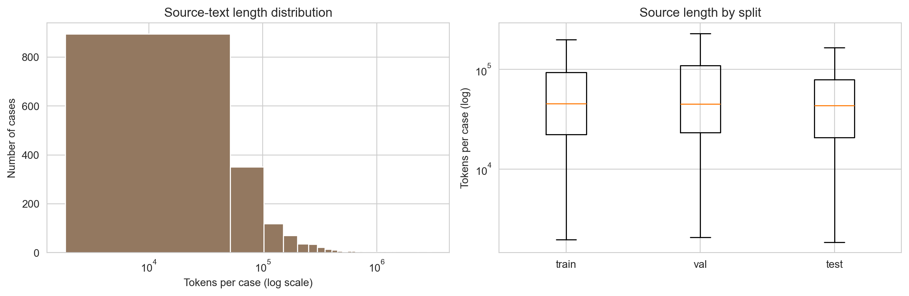
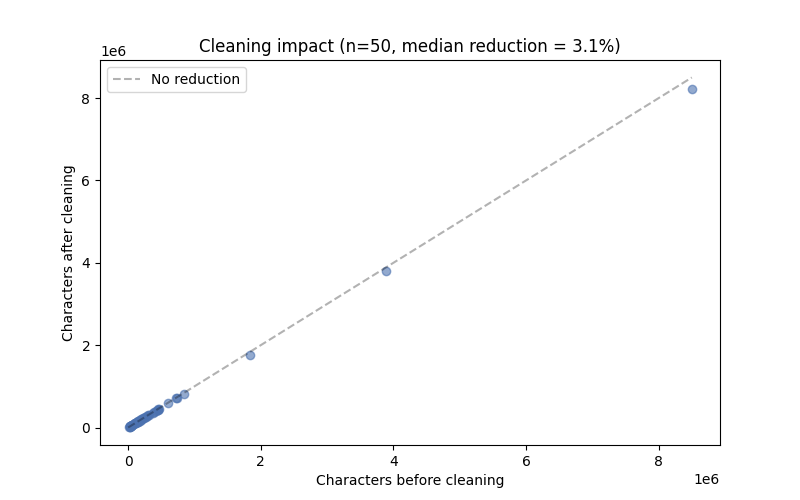
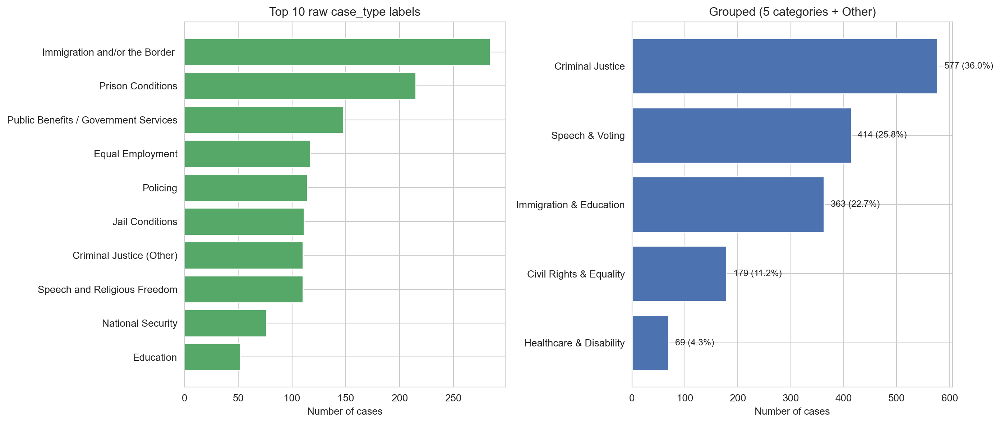
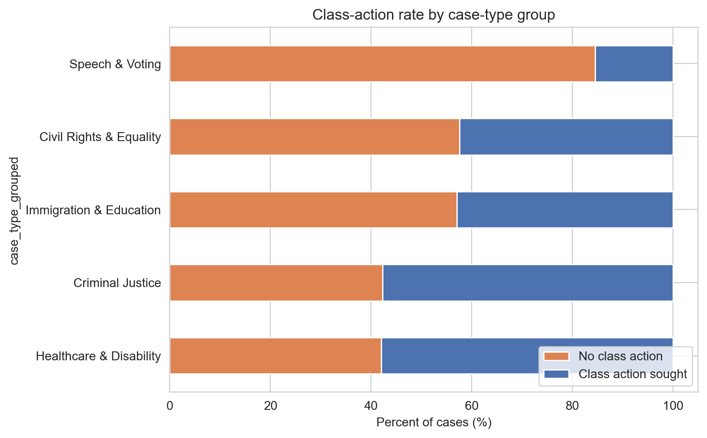

# Multi-LexSum: Hierarchical Summarization & Civil Rights Lawsuit Classification

> Northwestern MLDS · NLP Final Project · Spring 2026
> Team: Junbo Lian (Jacob), Yujun Sun, Feng Xiong, Jianong Xu

[](#)
[](#)

🤗 **Live Demo**: https://huggingface.co/spaces/<team>/multilexsum-demo *(Jianong to fill)*

---

## Overview

This project tackles Option 2 of the NLP final project using the **Multi-LexSum** dataset — 9,280 federal civil-rights case summaries authored by legal experts. We deliver three components:

1. **Multi-granularity summarization** — long / short / tiny summaries for cases that frequently exceed 200 pages of source text.
2. **Two classifiers** — predicting (a) whether a class action was sought (binary) and (b) the case type (5–7 grouped categories).
3. **Interactive Gradio app** — paste any case text and get all summaries + both predictions with explanations.

## Quick Start

```bash
git clone https://github.com/<team>/nlp-final-multilexsum.git
cd nlp-final-multilexsum
pip install -r requirements.txt

# Download + cache data (~5 min, ~2 GB)
python -m src.data --download

# Reproduce all results (GPU recommended for §3.4-3.5)
make all

# Launch the Gradio app locally
python -m app.gradio_app
```

## Repository Structure

```
nlp-final-multilexsum/
├── data/                     # parquet cache (gitignored)
├── notebooks/                # 01_eda → 06_error_analysis
├── src/
│   ├── data.py               # HuggingFace loader + caching
│   ├── cleaning.py           # regex + spaCy normalization
│   ├── case_type_grouping.py # 10+ raw types → 5–7 main categories
│   ├── features.py           # TF-IDF / Word2Vec / BERT tokenizer
│   ├── summarize/            # extractive, abstractive, tiny, pipeline
│   ├── classify/             # NB, LR, Bi-LSTM, Legal-BERT
│   ├── evaluate.py           # ROUGE / BERTScore / classification report
│   └── explain.py            # SHAP + bertviz
├── app/                      # Gradio app + inference entry point
├── models/                   # checkpoints (gitignored)
└── results/                  # all figures and CSVs (PPT sources here)
```

## Schedule

| Milestone | Due | Owners | Required deliverables |
|-----------|-----|--------|----------------------|
| **W6 Foundation** | end of W6 (Sun) | Jacob, Jianong | §1 complete · HF Spaces hello-world deployed |
| **W7 Baselines** | end of W7 (Sun) | Feng, Yujun, Jianong | NB + LR on both tasks · LexRank/TextRank extractive · Gradio dummy-model UI · PPT template |
| **W8 Full Models** | end of W8 (Sun) | Feng, Yujun | Bi-LSTM + Legal-BERT on both tasks · 3-granularity summarization complete · all slide drafts |
| **W9 Integration** | end of W9 (Sun) | Jianong, all | Real Gradio app on HF Spaces · explainability · error analysis · unified slide review |
| **W10 Launch** | before W10 class | Jianong, Jacob | Demo video recorded + edited · README sections all replaced |

Status by section: see the indicator next to each header below (🔴 TODO · 🟡 in progress · ✅ complete).

---

# §1 Data and Preprocessing  *(owner: Jacob — ✅ complete)*

## 1.1 Dataset

We use the [`allenai/multi_lexsum`](https://huggingface.co/datasets/allenai/multi_lexsum) dataset (version `v20230518`). The raw release contains **4,539 federal civil-rights cases**; after filtering to cases that have all three reference summaries plus complete classification metadata, our working set is **1,602 cases**. Each entry includes:

- **Source documents**: full legal filings concatenated across multiple docs per case; lengths vary by 3 orders of magnitude (min 1.8k → max 3.0M tokens)
- **Three reference summaries** at distinct granularities, expert-authored and reviewed
- **Metadata**: `class_action_sought` (binary), `case_type` (24 raw labels), filing date, court, state

### Working-set statistics

| Statistic | Value |
|-----------|-------|
| Cases (after filtering) | **1,602** |
| Train / Val / Test | 1,129 / 161 / 312 |
| Source-text tokens — median · mean · p95 · max | 44,789 · 94,428 · 335,302 · **3,002,324** |
| Reference long summary tokens (median / max) | 638 / 8,481 |
| Reference short summary tokens (median / max) | 102 / 671 |
| Reference tiny summary tokens (median / max) | 19 / 43 |
| `class_action_sought = True` rate | 41.8% (class-balance ratio 0.72) |
| `case_type` raw labels | 24 |
| `case_type` grouped categories | 5 (Other empty after final mapping) |

Full EDA: [`notebooks/01_eda.ipynb`](notebooks/01_eda.ipynb); figures in `results/eda/`; raw stats in `results/eda/summary_stats.json`.



*Source-text token distribution. Left: histogram on log x-scale showing the 3-orders-of-magnitude spread. Right: box plot by split — train/val/test distributions are nearly identical, so no distribution-shift concerns for evaluation.*

**Why this motivates hierarchical summarization**: median case has ~45k tokens (87× BERT's 512 limit, 11× Longformer's 4k); top 5% exceed 335k tokens; the longest case is 3M tokens. Direct transformer feed is impossible — see §2.

## 1.2 Cleaning Pipeline

`src/cleaning.py` applies seven regex passes to strip legal-document noise. Hit counts measured on a 50-case sample:

| Pattern | Cases hit | Mean hits / case | Purpose |
|---------|-----------|------------------|---------|
| Reporter citations (`123 F.3d 456`) | 47/50 | **614** | strip case-law references |
| Page markers (`[Page X of Y]`, `Page 3`) | 44/50 | 105 | strip pagination |
| U.S.C. references (`42 U.S.C. § 1983`) | 49/50 | 63 | strip statute citations |
| C.F.R. references (`29 C.F.R. § 1604.11`) | 17/50 | 14 | strip regulation citations |
| Footnote markers (`[1]`, `[fn 2]`) | 14/50 | 8 | strip footnote refs |
| URLs and emails | rare | <1 | strip web artifacts |
| Whitespace normalization | all | — | collapse `\s+` → single space |

Average character-length reduction is **3.1%** (median 3.1%, max 5.2%). The reduction is modest in raw byte terms but substantively important — it removes ~700 high-frequency citation tokens per case that would otherwise dominate TF-IDF features and confuse summarization models.



*Before vs after character count on a 50-case sample (log scale). Points sit close to the diagonal because the absolute reduction is small, but the citations removed are high-information-density features the regex catches consistently.*

Processing throughput: **74 ms / case** on a single CPU core (entire 1,602-case set cleans in ~2 min).

Before/after comparison: [`notebooks/02_cleaning.ipynb`](notebooks/02_cleaning.ipynb).

## 1.3 case_type Grouping

The raw `case_type` field has **24 labels** (observed in v20230518). We collapse them into **5 thematically coherent groups**:

| Grouped Category | Original `case_type` Values | Cases |
|-----------------|---------------------------|-------|
| **Criminal Justice** | `Prison Conditions` · `Jail Conditions` · `Policing` · `Juvenile Institution` · `Criminal Justice (Other)` · `Indigent Defense` | 577 (36.0%) |
| **Speech & Voting** | `Speech and Religious Freedom` · `Election/Voting Rights` · `Public Benefits / Government Services` · `National Security` · `Presidential/Gubernatorial Authority` | 414 (25.8%) |
| **Immigration & Education** | `Immigration and/or the Border` · `Education` · `Child Welfare` | 363 (22.7%) |
| **Civil Rights & Equality** | `Equal Employment` · `Fair Housing/Lending/Insurance` · `Public Accomm./Contracting` · `School Desegregation` · `Environmental Justice` · `Public Housing` | 179 (11.2%) |
| **Healthcare & Disability** | `Disability Rights-Pub. Accom.` · `Mental Health (Facility)` · `Intellectual Disability (Facility)` · `Nursing Home Conditions` | 69 (4.3%) |
| Other | (none after fix) | 0 (0%) |

All 24 raw labels are accounted for. The `group_case_type()` function in `src/case_type_grouping.py` normalizes whitespace around `/` separators (Multi-LexSum uses both `"A/B"` and `"A / B"` forms in different labels), so the mapping is robust to either form.



*Left: top 10 of 24 raw `case_type` labels (long-tail visible — bottom 14 labels each have < 30 cases). Right: the 5 grouped categories. Grouping reduces from 24 → 5 classes while preserving thematic coherence.*



*Class-action rate varies sharply across groups: **Healthcare & Disability (58%) and Criminal Justice (57.7%) lean class-action**, while **Speech & Voting is only 15.5%** (mostly individual First Amendment challenges, not group claims). The strong group→target correlation here is a useful signal for §3.7 (`class_action_sought` prediction).*

**Class imbalance note**: Healthcare & Disability is the smallest group (4.3%). For §3 classification, use `class_weight='balanced'` (sklearn) or weighted cross-entropy (PyTorch/TF) to compensate.

Full mapping rationale: [`docs/case_type_grouping.md`](docs/case_type_grouping.md).

## 1.4 Output Schema

The cleaning pipeline produces a single canonical DataFrame, cached as `data/multilexsum_clean.parquet` (1,602 rows × 15 columns):

```python
case_id              : str          # e.g. 'PB-WV-0002'
source_text          : str          # cleaned full case (concatenated source docs)
n_source_docs        : int          # how many docs were joined
long_ref             : str          # provided long reference summary
short_ref            : str          # provided short reference summary
tiny_ref             : str          # provided one-sentence reference summary
class_action_sought  : bool         # target for §3.7
case_type_raw        : str          # 24 distinct values
case_type_grouped    : str          # 5 groups + 'Other' (target for §3.8)
filing_date          : str | None
court                : str | None
state                : str | None
source_n_chars       : int          # length of cleaned text
source_n_tokens      : int          # whitespace tokens of cleaned text
split                : {'train', 'val', 'test'}
```

## 1.5 Reproducing

```bash
python -m src.data            # ~5–10 min: download + flatten + cache
python -m src.cleaning        # ~2 min: regex + grouping + filter
# Then open notebooks/01_eda.ipynb and Run All
```

EDA notebook: [`notebooks/01_eda.ipynb`](notebooks/01_eda.ipynb)

---

# §2 Multi-Granularity Summarization  *(owner: Yujun · 🔴 TODO)*

**Deadlines**: W7 extractive baseline · W8 full pipeline + evaluation
**Depends on**: §1 cleaned parquet (`data/multilexsum_clean.parquet`)

## To do

When you replace this block, your content goes under these sub-section numbers (so the slide structure mirrors the README):

1. **2.1 Motivation** — why hierarchical (200+ page source vs transformer context limits)
2. **2.2 Stage A: Extractive Reduction** — LexRank vs TextRank, params chosen, output size
3. **2.3 Stage B: Abstractive Generation** — model selection (BART-large-cnn vs Pegasus-X vs LED-large) with justification table; long + short generation details
4. **2.4 Tiny Summary** — T5-small fine-tune (training pairs, epochs, lr, val-loss curve)
5. **2.5 LLM Zero-Shot Baseline** — model choice (Claude Haiku / GPT-4o-mini), prompt template, cost
6. **2.6 Evaluation** — ROUGE-1/2/L + BERTScore vs reference, table per granularity
7. **2.7 Qualitative Analysis** — 1 good case + 1 hallucination case side-by-side
8. **2.8 Reproducing** — command-line invocation

## Deliverables checklist

**Code — W7**:
- [ ] `src/summarize/extractive.py` — LexRank + TextRank with shared interface

**Code — W8**:
- [ ] `src/summarize/abstractive.py` — BART / Pegasus / LED (one chosen + justified in §2.3)
- [ ] `src/summarize/tiny.py` — T5-small fine-tune
- [ ] `src/summarize/pipeline.py` — single `summarize(text) -> {long, short, tiny}` entry point
- [ ] `src/summarize/llm_baseline.py` — zero-shot Claude Haiku / GPT-4o-mini
- [ ] `src/evaluate.py` (summary section) — ROUGE + BERTScore wrapper

**Artifacts — W8**:
- [ ] `models/t5_tiny_summarizer/`
- [ ] `results/extractive_lengths.csv` — original/reduced tokens per case (median reduction ≥ 90%)
- [ ] `results/summary_eval.csv` — per case × per granularity ROUGE + BERTScore
- [ ] `notebooks/03_summarization.ipynb` — qualitative analysis (5 good + 5 hallucination cases)

**Slides — W8**: slides 4–6 drafts in `presentation/slides.pptx` (see Presentation Plan below)

🔴 **Status**: not yet written.

---

# §3 Classification  *(owner: Feng · 🔴 TODO)*

**Deadlines**: W7 classical baselines (NB + LR) · W8 deep models (Bi-LSTM + Legal-BERT)
**Depends on**: §1 cleaned parquet · §2 long summaries (optional; can start with `long_ref` reference summaries while waiting)

## To do

Sub-section numbering (mirrors slides 7-9):

1. **3.1 Task Setup** — input choice (`long_ref` initially, then model-generated long summary); train/val/test sizes per task
2. **3.2 Featurization** — TF-IDF (uni+bigram) for classical; Word2Vec for LSTM; Legal-BERT tokenizer for BERT
3. **3.3 Naive Bayes** — variant, smoothing, class balancing
4. **3.4 Logistic Regression** — regularization, class balancing, SHAP top-token plot
5. **3.5 Bi-LSTM** — architecture (layers, hidden dim, dropout), embedding init, training config
6. **3.6 Legal-BERT Fine-tune** — `nlpaueb/legal-bert-base-uncased`, training config, GPU notes
7. **3.7 Results — class_action_sought** — 4-model table (accuracy, F1, AUC) + ROC plot
8. **3.8 Results — case_type** — 4-model table (macro-F1, per-class P/R) + confusion matrices
9. **3.9 Reproducing** — command-line invocations

## Deliverables checklist

**Code — W7**:
- [ ] `src/features.py` — TF-IDF (uni+bigram) + class-balanced support
- [ ] `src/classify/classical.py` — NB + LR with consistent train/eval API
- [ ] `src/classify/train.py` — unified training entry: `python -m src.classify.train --task class_action --model nb`

**Code — W8**:
- [ ] `src/classify/lstm.py` — Bi-LSTM with Word2Vec init (TF/Keras)
- [ ] `src/classify/bert.py` — HF Transformers fine-tune loop

**Artifacts — W7**:
- [ ] `models/nb_classaction.pkl`, `models/lr_classaction.pkl`
- [ ] `models/nb_casetype.pkl`, `models/lr_casetype.pkl`
- [ ] `results/lr_shap_classaction.png`, `results/lr_shap_casetype.png`
- [ ] `notebooks/04_classification_class_action.ipynb` (NB + LR sections)
- [ ] `results/classification_metrics.csv` — appended per model

**Artifacts — W8**:
- [ ] `models/lstm_classaction.h5`, `models/lstm_casetype.h5`
- [ ] `models/bert_classaction/`, `models/bert_casetype/`
- [ ] `results/training_curves/lstm_*.png` (loss + accuracy per epoch — required by syllabus W5)
- [ ] `results/confusion_matrices/*.png` for all 4 models on case_type
- [ ] `notebooks/05_classification_case_type.ipynb` (all 4 models on case_type)
- [ ] Final `results/classification_metrics.csv` with all 4 × 2 = 8 model scores

**Slides — W8**: slides 7–9 drafts in `presentation/slides.pptx`

🔴 **Status**: not yet written.

---

# §4 Interactive Tool & Evaluation  *(owner: Jianong · 🔴 TODO)*

**Deadlines**: W6 HF Spaces hello-world · W7 dummy-model UI + PPT template · W9 real-model integration + explainability
**Depends on**: §2 summarization pipeline + §3 trained models (for W9 only)

## To do

Sub-section numbering (mirrors slides 10-11):

1. **4.1 Gradio App Architecture** — three-tab design (Summaries / Predictions / Explainability) + UI screenshot
2. **4.2 Inference Pipeline** — `app/inference.py`: model loading + single `predict()` entry point
3. **4.3 Explainability** — SHAP for LR (top tokens), bertviz attention for BERT (sample heatmap)
4. **4.4 Error Analysis** — 5 interesting cases: model disagreement, summary-vs-reference divergence, confidence-vs-correctness
5. **4.5 Evaluation Framework** — `src/evaluate.py` unified interface (CSV / PNG outputs)
6. **4.6 HuggingFace Spaces Deployment** — link, model quantization notes, free-tier limits handled
7. **4.7 Local Usage** — `python -m app.gradio_app`

## Deliverables checklist

**Code — W6**:
- [ ] HF Spaces created (free tier, public) — URL posted in team chat
- [ ] `app/gradio_app.py` — minimal text-in / text-out placeholder, deployed

**Code — W7**:
- [ ] `app/gradio_app.py` — three-tab UI scaffold; each tab wired to a dummy function returning fixed text
- [ ] `presentation/template.pptx` — Northwestern purple, sans-serif, title 32pt / body 18pt

**Code — W9**:
- [ ] `app/inference.py` — `predict(case_text) -> {summaries, class_action, case_type}` unified entry
- [ ] `src/evaluate.py` (classification section) — `classification_report` + confusion matrix helpers
- [ ] `src/explain.py` — SHAP for LR + bertviz attention for BERT

**Artifacts — W9**:
- [ ] HF Spaces deployment with real models (fits within free-tier 16 GB image limit — use quantization or Inference API)
- [ ] `notebooks/06_error_analysis.ipynb`
- [ ] `results/error_cases.md` — 5 disagreement case writeups (case_id + model predictions + reference + your analysis)
- [ ] Final demo video recording (your screen + your voice for slides 10-12; collect Jacob/Yujun/Feng audio for their slides)

**Slides — W9**: slides 10-12 drafts in `presentation/slides.pptx`

🔴 **Status**: not yet written.

---

# §5 Lessons & Future Work  *(owner: Jianong · 🔴 TODO)*

**Deadline**: W9 (after §2 / §3 / §4 are filled in)

## To do

Sub-section numbering (mirrors slide 12):

1. **5.1 Three main takeaways** — one each from summarization, classification, and the interactive tool (technical lessons, not generic "we learned a lot")
2. **5.2 What didn't work** — one paragraph honest about a failure mode (specific hallucination pattern, BERT overfitting on small case_type groups, etc.)
3. **5.3 Future work** — 2-3 concrete extensions (e.g. Legal-LLaMA fine-tuning, hierarchical attention pooling, retrieval-augmented summarization)

🔴 **Status**: not yet written.

---

## Presentation Plan

12 slides · ~10 min final video.

| # | Slide | Owner | Time | Key visual / source |
|---|-------|-------|------|--------------------|
| 1 | Title + Team | **Jacob** | 15s | Project name, 4-person credit |
| 2 | Problem & Multi-LexSum | **Jacob** | 60s | Dataset stats + 200+ page case screenshot |
| 3 | Data Cleaning + EDA + case_type Grouping | **Jacob** | 75s | `results/eda/class_action_distribution.png`, `case_type_distribution.png`, `cleaning_impact.png` + 5-group mapping table |
| 4 | Why Hierarchical Summarization | **Yujun** | 45s | `results/eda/source_length_distribution.png` + transformer context limits |
| 5 | Pipeline: Extract → Abstract | **Yujun** | 75s | Flow diagram: full case → LexRank → BART → 3 granularities |
| 6 | Summarization Results vs Reference | **Yujun** | 60s | ROUGE/BERTScore table + 1 good + 1 hallucination case |
| 7 | Classification Approach | **Feng** | 45s | 4 models × 2 tasks matrix |
| 8 | Results: class_action_sought | **Feng** | 60s | F1/AUC bars + ROC curves (4 models) |
| 9 | Results: case_type | **Feng** | 60s | macro-F1 table + confusion matrix for best model |
| 10 | Interactive Tool — Live Demo | **Jianong** | 90s | Live Gradio screencast at 1080p (pre-record backup) |
| 11 | Explainability & Error Analysis | **Jianong** | 45s | SHAP top-tokens + BERT attention + 1-2 disagreement cases |
| 12 | Lessons & Future Work | **Jianong** | 30s | 3 takeaways + 2 future directions |

**Speaking time**: Yujun 3 min (most, owns hardest content) · Feng 2.75 · Jianong 2.75 · Jacob 2.5 · total ~11 min → trim to 10 in editing.

**Rules**:
1. All figures from `results/` — no ad-hoc notebook screenshots
2. Sentence case headings, never ALL CAPS
3. One key visual per slide; if you want two, split the slide

---

## How to Replace Your Section

If you're a teammate filling in your section:

1. **Open this file in your editor.**
2. **Find your section header** (e.g., `# §2 Multi-Granularity Summarization`).
3. **Delete the entire `> TODO` block and the `🔴 Status: not yet written.` line.**
4. **Replace with your actual content**, keeping the sub-section numbering (2.1, 2.2, …) as listed in the TODO checklist so the structure stays consistent.
5. **Add image/CSV references** as relative links — figures live in `results/`, e.g. ``.
6. **Update the status line** at the top of your section from `🔴 TODO` to `✅ complete`.
7. **Commit with a clear message**: `docs(readme): fill §3 classification`

If you need to add a sub-section, put it at the end of your block (e.g., 3.10) — don't insert into Jacob's or others' blocks.

---

## Working Agreement

A few rules we follow to keep the project clean:

1. **Single source of truth for data**: `data/multilexsum_clean.parquet` is the only dataset file anyone reads. Don't re-clean from raw.
2. **Slide drafts due W8 end, not W9** — placeholder figures OK at this stage.
3. **Figures come from `results/`** — don't screenshot from notebooks; re-export the figure as PNG into `results/` and reference the file path in slides.
4. **Replace TODO blocks via PR, not chat** — keep README as the canonical record of what's done.
5. **Gradio starts in W7 with dummy models** — don't wait for real models to be done.
6. **Weekly sync**: Sundays 21:00 Beijing time, 30 min.

## Citation

If you use this work or the underlying dataset:

```bibtex
@inproceedings{shen-etal-2022-multi-lexsum,
  title     = {{Multi-LexSum}: Real-World Summaries of Civil Rights Lawsuits at Multiple Granularities},
  author    = {Shen, Zejiang and Lo, Kyle and Yu, Lauren and Dahlberg, Nathan and Schlanger, Margo and Downey, Doug},
  booktitle = {Advances in Neural Information Processing Systems},
  year      = {2022}
}
```

## License

MIT
